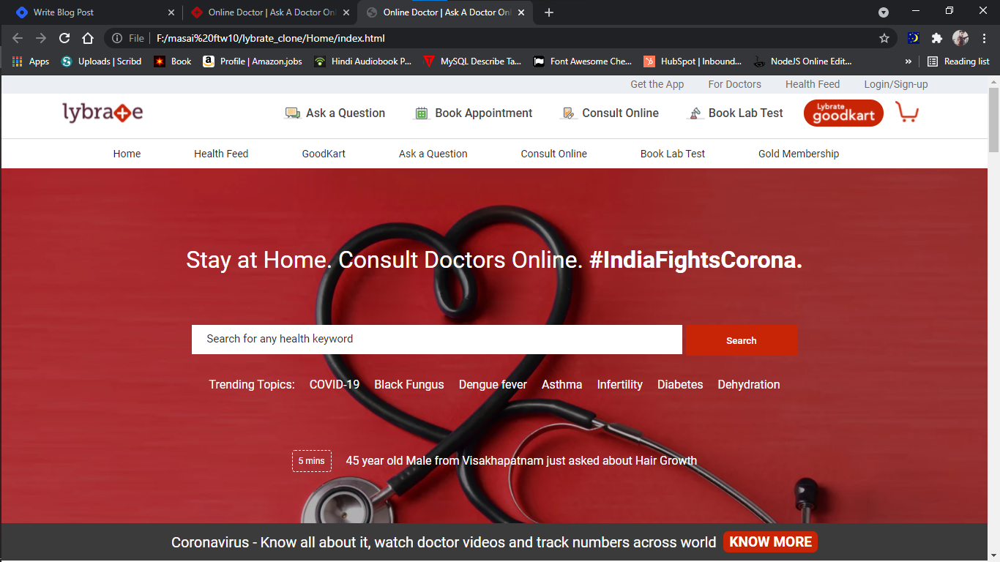
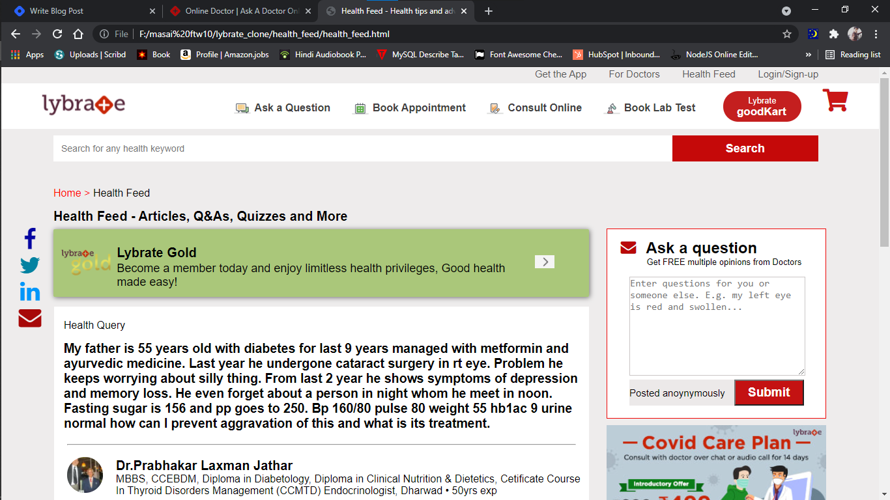
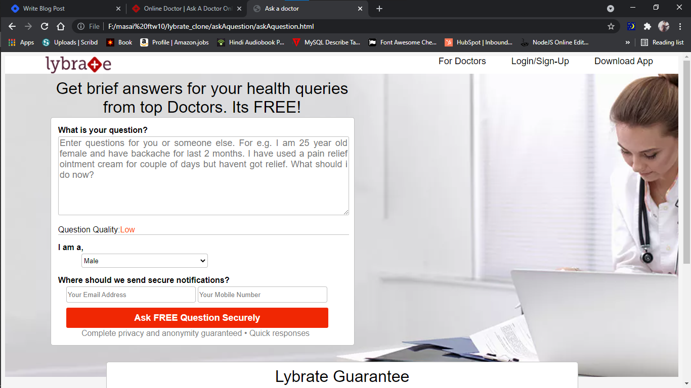

# lybrate_clone

welcome to this repo,

as part of unit2 construct week our team(sagar, deepak, ankur and harsh) was asigned a task to clone the website lybrate(https://www.lybrate.com/?lpt=NAV), we have worked 4 days straight day and night and given our best to clone in the best possible way we can.

TOOLS AND TECHNOLOGY USED >

HTML, css, javascript , js dom manipulation, font Awesom icons

WEBSITE CONTENT CLONED>

here the home, bookApointment, consultOnline, goodCart, login/signup, healthfeed and doctors sections are the part we have majorly focused to clone(create)

Home Page

health feed Page

health feed Page

WEBSITE USER FLOW >

the user flow that we tried to maintain is,
home -> healthfeed -> bookApointment -> askQuestion -> login/signup -> ask question-> forDoctors -> login/signup -> answerQuestion & view submitted responses -> healthfed(to view updated) -> home

also, to explore

home -> consultOnline -> consultNow
home -> goodcart ->home

MESSAGE FROM TEAM >

we really enjoyed this whole part of clonning and have given our best efforts to bring the BEST thing as POSSIBLE.
